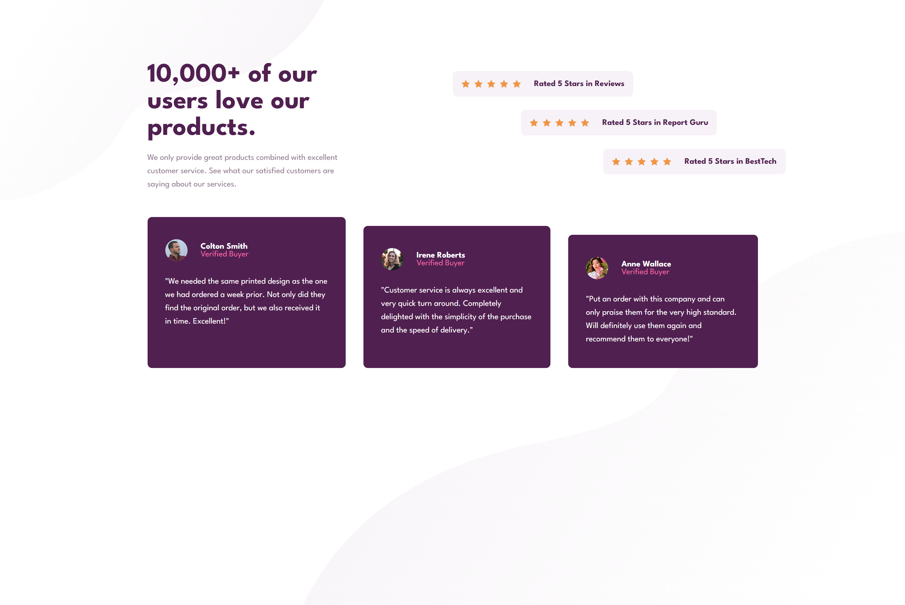
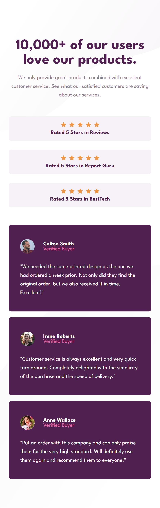

# Frontend Mentor - Social proof section solution

This is a solution to the [Social proof section challenge on Frontend Mentor](https://www.frontendmentor.io/challenges/social-proof-section-6e0qTv_bA). Frontend Mentor challenges help you improve your coding skills by building realistic projects. 

## Table of contents

- [Overview](#overview)
  - [The challenge](#the-challenge)
  - [Screenshot](#screenshot)
  - [Links](#links)
- [My process](#my-process)
  - [Built with](#built-with)
  - [What I learned](#what-i-learned)
  - [Continued development](#continued-development)
  - [Useful resources](#useful-resources)
- [Author](#author)
- [Acknowledgments](#acknowledgments)

## Overview

### The challenge

Users should be able to:

- View the optimal layout for the section depending on their device's screen size

### Screenshot

### Links

- Solution URL: <a href="https://www.frontendmentor.io/solutions/stats-preview-card-coponent-wp8XAbrBA1" target="_blank" rel="noreferrer"> Solution </a>
- Live Site URL: <a href="https://social-proof-sectiion.netlify.app/" target="_blank" rel="noreferrer">Live Site </a>

## My process

### Built with

- Semantic HTML5 markup
- CSS custom properties
- Flexbox

### What I learned

- This project was an excellent way to practice creating a flexible and responsive layout. I focused on using Flexbox to manage the main containers and their children. The key to the desktop layout was using `flex-wrap` and negative margins/transformations to create the staggered card effect.

### Continued development

- I plan to continue practicing with CSS Flexbox and Grid, focusing on more complex nested layouts. 

### Useful resources

- [A Complete Guide to Flexbox](https://css-tricks.com/snippets/css/a-guide-to-flexbox/) - This is my go-to guide for all things Flexbox.it going forward.
- [MDN Web Docs](https://developer.mozilla.org/en-US/) - An invaluable resource for checking CSS property definitions and browser compatibility.

## Author

- Frontend Mentor - <a href="https://www.frontendmentor.io/profile/poseidon0211-hub" target="_blank" rel="noreferrer">@poseidon0211-hub</a>

## Acknowledgments

- I am deeply grateful to Mr. Albert for his dedicated support and encouragement throughout my learning journey in HTML and CSS. His clear explanations and practical advice were especially helpful in completing the Product Component project. His mentorship made a significant impact on my understanding and confidence in front-end development.

